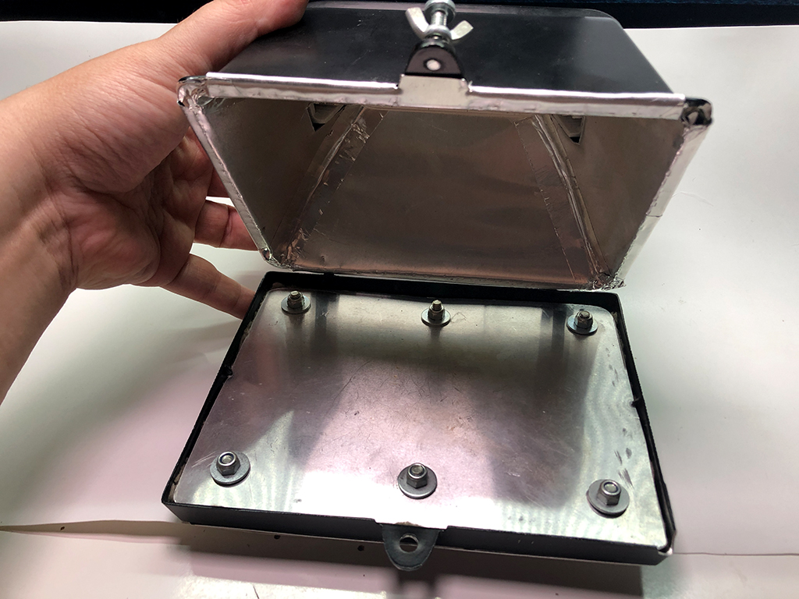

Пайка SMD на прожекторе по профилю
========================

Контроллер галогенового прожектора для пайки паяльной пастой SMD по профилю. Благодаря термопрофилю получаем качественно запаянные компоненты без следов флюса.

Суть заключается в том, что весь процесс пайки разбит на несколько режимов нагрева.
Сначала идет предварительный нагрев, он позволяет снизить тепловой удар на электронные компоненты.
Далее стадия активации флюса, тек же в ней происходит температурное выравнивание всех компонентов.
Далее стадия оплавления пасты, здесь температура повышается до плавления припоя в пасте и происходит сама пайка.
И наконец стадия охлаждения.
Благодаря термопрофилю получаем качественно запаянные компоненты без следов флюса.

Плата
-------

|   Верх                 | Низ
|------------------------|---------------------------------
|   | 

Разделена высоковольтная и низковольтная часть. Убрана заливка платы.
Arduino Nano распаяна прямо на плату. Также распаян датчик температуры. Точнее его микросхема.
Появился трансформатор питающий низковольтную часть. Теперь не нужен блок питания.
Заменен экран 1.8" на 2.4" с более высоким разрешением. У него логическая часть 3.3 вольта, соответственно 
на плате есть стабилизатор питающий экран и Атмегу этим напряжением.
Распаян энкодер.
Остальное как у автора.

|   Верх                    | Низ
|---------------------------|---------------------------------
|   | 

#### BOM:

|No|Name|Value|Layer|Comment
|---|---|---|---|---
|1|C1|0.33u|Bottom|0805
|2|C2|10u 6.3v|Bottom|Tantal
|3|C3|0.1u|Bottom|0805
|4|C4|0.1u|Bottom|0805
|5|C5|0.1u|Bottom|0805
|6|C6|0.1u|Bottom|0805
|7|C7|0.1u|Bottom|0805
|8|C8|10n|Bottom|К73-17
|9|Q1|8Mhz|Bottom|
|10|Q2|Buzzer|Bottom|
|11|R1|10k|Bottom|0805
|12|R2|10k|Bottom|0805
|13|R3|10k|Bottom|0805
|14|R4|47k|Bottom|0.6W
|15|R5|47k|Bottom|0.6W
|16|R6|2.4k|Bottom|0.25W
|17|R7|180R|Bottom|0.25W
|18|S1|Encoder|Top|
|19|S2|301-021-12|Bottom|
|20|S3|301-021-12|Bottom|
|21|S4|301-021-12|Bottom|
|22|S5|Fuse|Bottom|
|23|SCREEN|2.4TFT|Top|SPI 240x320
|24|T1|TSP-12|Bottom|220v/12v
|25|U1|Atmega328|Bottom|
|26|U2|MC33269DT-3.3G|Bottom|D-PAK
|27|U3|MAX6675|Bottom|SO-8
|28|U4|H11AA1|Bottom|DIP6
|29|U5|MOC3020M|Bottom|DIP6
|30|U6|BT137|Bottom|TO-220AB

Корпус
-------

Все построено на обычном 500-ватном галогеновом прожекторе из любого магазина стройматериалов.
Несмотря на его пластиковый корпус температура нагреваемая лампой уходит за 300 градусов, что вполне хватит чтобы расплавить пасту.
Также для равномерности нагревания утеплил его базальтовой ватой и обшил алюминием.
Прибор очень понравился в работе. Но есть и косяк. Лампа всеже не равномерно нагревает пространство.
И прибор подходит для мелких плат которые располагаются по середине прожектора.

|   Внутри               | Снаружи
|------------------------|---------------------------------
|    | 
|    | 

Прошивка
-------

* Любым программатором загружается bootloader (HEX файл и фьюзы прилагаются). Самой простой вариант прошить через USB Arduino NANO и "сдуть" с нее чип.
* Впаивается чип на плату.
* Заливается INO файл из Arduino IDE (как Arduino NANO) с помощью USB-UART преобразователя (FTDI).

Контакты
-------

GitHub автора: https://github.com/dasaki/nanoReflowController

Связаться со мной: dementiev@me.com